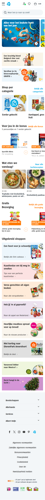
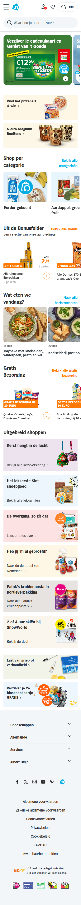
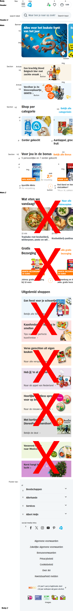
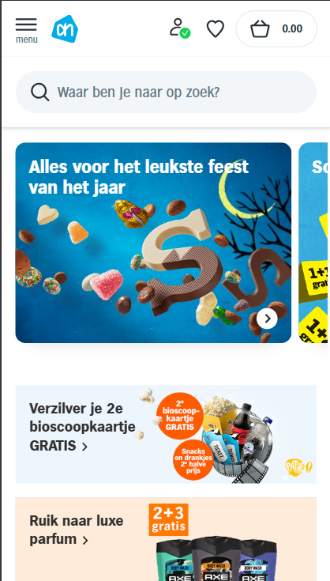
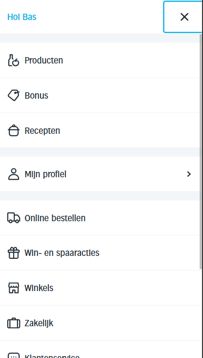
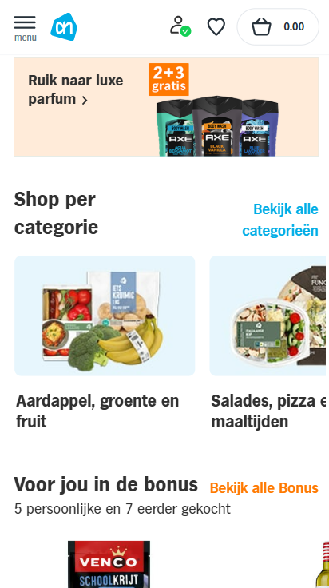
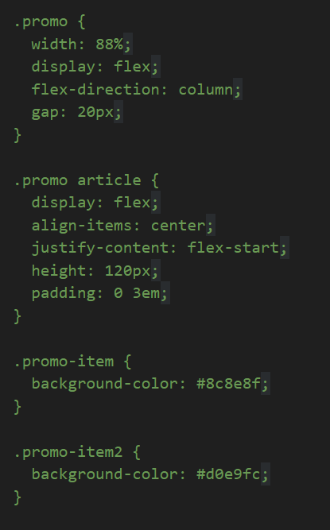
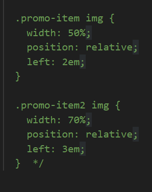
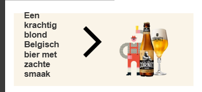
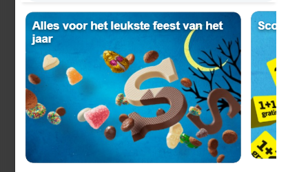

# Procesverslag
Markdown is een simpele manier om HTML te schrijven.  
Markdown cheat cheet: [Hulp bij het schrijven van Markdown](https://github.com/adam-p/markdown-here/wiki/Markdown-Cheatsheet).

Nb. De standaardstructuur en de spartaanse opmaak van de README.md zijn helemaal prima. Het gaat om de inhoud van je procesverslag. Besteedt de tijd voor pracht en praal aan je website.

Nb. Door *open* toe te voegen aan een *details* element kun je deze standaard open zetten. Fijn om dat steeds voor de relevante stuk(ken) te doen.

## Jij

  
uitwerken voor kick-off werkgroep

  ### Auteur:
  Bas Witmond

  #### Je startniveau:
  Blauwe piste

  #### Je focus:
  Surface plan
 

## Je website
 https://bashva.github.io/blokwebwebsite/

  
uitwerken voor kick-off werkgroep

  ### Je opdracht:
  https://www.ah.nl/

  #### Screenshot(s) van de eerste pagina (small screen): 
  Homepagina Albert Heijn
  

  #### Screenshot(s) van de tweede pagina (small screen):
  Productpagina Albert Heijn
  
 

## Toegankelijkheidstest 1/2 (week 1)

  
uitwerken na test in 2e werkgroep

  ### Bevindingen
  Lijst met je bevindingen die in de test naar voren kwamen:

  Homepagina:
  -Screenreader noemt alle dingen die in de website naar voren moeten komen op, alleen gaat het bij de decoratieve afbeeldingen soms fout en zijn sommige stukjes lastig met een screenreader te bereiken.. 
  -Was voor mij allemaal vrij helder om de homepagina met de screenreader te gebruiken.

  Productpagina:
  -Screenreader leest alle onderdelen goed voor en snapt ook dat de screenreader bij afbeeldingen uitleg geeft.
   Zo wordt de ALT bij de images waar het moet goed gebruikt en voorgelezen, maar bij decoratieve afbeeldingen niet altijd en gaat dit fout.
  -Was voor mij allemaal vrij helder om de product pagina met de screenreader te gebruiken.

WCAG CHECKLIST: (VOOR AH.NL)

--ALGEMEEN--
HTML-validatie:
De HTML-code heeft wel wat fouten, hierdoor werkt de website niet 100% goed voor iedereen.

Alt-teksten:
Sommige afbeeldingen hadden een rare alt text wat niet goed werd voorgelezen door de screenreader. Toen ik in de code ging checken klopte het bij sommige images bijvoorbeeld wel en sommige andere objecten niet.

Toetsenbordnavigatie:
De website moet makkelijk met het toetsenbord te navigeren zijn en dit is niet 100% het geval. Sommige menu's zijn nog lastig te bereiken zonder muis.

--Problemen--
Logische heading-structuur:
De koppen staan niet altijd in de juiste volgorde, wat het moeilijk maakt om met een screenreader de pagina te lezen en snappen.

Decoratieve afbeeldingen:
Sommige afbeeldingen worden zonder dat het moet voorgelezen door de screenreader. Decoratieve afbeeldingen moeten een leeg alt-tekst hebben en dit is nu niet zo.

Formuliervelden:
Sommige invulvelden missen labels, wat verwarrend is.

Skip-links:
De skip-link is niet altijd goed zichtbaar, hierdoor kan je moeilijk snel naar inhoud springen.

Contrastproblemen:
Sommige stukjes hebben een raar kleurcontrast. Het lijkt mij voor een kleurenblind persoon best pittig om dat te kunnen lezen.

--Verbeterpunten--
Heading-structuur verbeteren:
Zorg ervoor dat de koppen logisch geordend zijn, zodat de website makkelijker te begrijpen en te lezen is met een screenreader.

Alt-teksten voor decoratieve afbeeldingen:
Alle alt-teksten moeten leeg voor decoratieve afbeeldingen want nu slaat de screenreader ze niet allemaal over wat verwarrend is.

Duidelijke labels voor invoervelden:
Alle invulvelden moeten duidelijke labels hebben zodat mensen zelf ook weten wat ze moeten invullen.

## Breakdownschets (week 1)

  
uitwerken na afloop 3e werkgroep

  ### de hele pagina: 
  

  ### dynamisch deel (bijv menu): 
  
  

  ### wellicht nog een dynamisch deel (bijv filter): 
  
  

## Voortgang 1 (week 2)

  
uitwerken voor 1e voortgang

  ### Stand van zaken
  
  
  Ik vond dit stukje code lastig, aangezien het gewoon niet werkte wat ik ook probeerde met mijn website.
  Uiteindelijk heb ik het gedeeltelijk gefixt door mijn article te stijlen en een extra class toe te voegen.
  Verder heb ik het voor nu maar gelaten, aangezien het belangrijker was om eerst de HTML goed op orde te hebben.

  ### Agenda voor meeting
  samen met je groepje opstellen
  
  -Bespreken / vraag stellen over validator dat hij 8 info's aangeeft en zegt dat ik een h2 moet plaatsen
   maar ik snap niet wat hiermee wordt bedoeld.

  -Student 1 (Bas) -> Vragen stellen over validator. Hij geeft bij mij (Bas) 8 info's aan en zegt dat er h2's moeten
  worden geplaatst.

  -Student 2 (Maya) -> Vragen wat er in een section moet. En of het nodig is om 1 section of meerdere te maken.

  -Student 3 (Jazzmine) -> Vraag of ze alle blokjes / secties op haar website moest maken die hetzelfde waren.
  
  -Student 4 (Jegor) -> (Niet aanwezig bij feedbackgesprek)

  ### Verslag van meeting
  hier na afloop snel de uitkomsten van de meeting vastleggen

  -Buttons aanpassen naar een a. Button zelfde pagina a andere pagina.
  -Sportlife mints h3.
  -Bekijk alle bonus link.
  -3/4 zodat je kan schuiven.
  -h2 onzichtbaar of div met daarin sections.
  -Alleen voor styling kan je div gebruiken.
  -Als het titel heeft section.
  -Minder classes gebruiken.
  -Vaker voorkomt verschillende plekken class.
  -Box-shadow om header heen doen.
  -hr tag lijn doen.
  -Nav border bottem.

## Voortgang 2 (week 3)

  
uitwerken voor 2e voortgang

  ### Stand van zaken
  
  
  Het eerste stukje code had ik veel moeite mee en heb ik ook een vraag over voor bij het feedback gesprek.
  Ik kreeg de "right arrow" niet kleiner en dat kostte me best veel moeite.
  Het stukje wat wel goed ging was de banner goed maken. Ik kreeg de 2 banners makkelijk en goed naast elkaar
  en dit maakte me blij, want eindelijk werkte iets hoe ik het graag had gewild.

  ### Agenda voor meeting
  samen met je groepje opstellen

  -Bespreken / vraag stellen over dat mijn right arrow / pijltje niet kleiner wordt / dat ik hem niet kleiner krijg. Ook vraag stellen over de extra dingen die je moet maken en wat ik kan weglaten / moet maken van de zoekbalk.

  -Student 1 (Bas) -> Vraag stellen over pijltje right arrow die ik niet kleiner krijgen. Ook vraag stellen over de zoekbalk wat ik er van moet maken en wat ik ervan weg kan laten. Evt nog vragen wat van de 5 extra dingen je van het lijstje moet maken of zelf verzinnen.

  -Student 2 (Maya) -> Vraag over de kleur en afbeelding van de logo van de dopper site, aangezien deze niet download. Javascript vraag over code.

  -Student 3 (Thijs) -> Vraag over afbeeldingen waarom ze niet werken en vraag over wanneer en waar je ./ en /. wel of niet moet gebruiken. Kijken wat in de sections bij elkaar hoort en niet enkel richting de opmaak kijken.
  
  -Student 4 (Jegor) -> Vraag over hoe CSS doorgepusht kan worden, aangezien dit momenteel nog niet werkt. Vragen hoe de css wel moet worden gecodeerd in de html dat het doorgepusht kan worden. Ook de vraag hoe de images van tesla kunnen worden gekopiert naar zijn eigen webpagina.

  -Student 5 (Jazzmine) -> (Later, ingedeeld in groepje van C ipv B.)

  ### Verslag van meeting
  1. Hoogte uitzetten en breedte zelf aanpassen. of (2)  
  2. `::before` of `::after` toevoegen aan `<h2>` voor iconen of extra styling.  
  3. `
` en `
` gebruiken voor dropdownmenu.  
  4. Dropdownmenu uit de les toepassen.  
  5. Navigatie met dropdownmenu en icons erbuiten als linkjes toevoegen.  
  6. Zoekbalk `<input type="search">` gebruiken voor semantiek.  (fixed)
  7. Attribute selector gebruiken in CSS voor `<input type="search">`.  
  8. `prefers-reduced-motion` instellen voor betere toegankelijkheid.  
  9. Afbeeldingen zonder spaties of hoofdletters in bestandsnamen gebruiken. (fixed)
  10. CSS beter ordenen voor overzicht. (fixed)

## Toegankelijkheidstest 2/2 (week 4)

  
uitwerken na test in 9e werkgroep

  ### Bevindingen
**WCAG Checklist voor AH.nl**

**Algemeen:**
- HTML-validatie: De meeste HTML is in orde, maar ik moet nog een aantal info's fixen en die info's zijn dat er geen h2 is in een section bijvoorbeeld. Deze moet ik onzichtbaar maken zodat het wel duidelijk is voor de screenreader.

- Alt-teksten: Veel afbeeldingen hebben goede alt-teksten. Sommige nog iets duidelijker maken

- Toetsenbordnavigatie: De website is voor het grootste deel wel goed te bereiken met het toetsenbord. Sommige stukjes verbetering met hoe ik zelf ermee omga want ik vind het zelf erg lastig.

**Problemen:**
- Heading-structuur: Koppen staan nu wel in de juiste volgorde wat voorhene nog niet zo was. Dit is makkelijker te lezen voor de screenreader.

- Decoratieve afbeeldingen: Leest geen decoratieve afbeeldingen voor

- Contrast: VOor mensen met een visuele beperking moet ik sommige kleuren contrasten iets duidelijker maken had ik door. Soms had ik zelf moeite met een paar stukjes, laat staan iemand met een visuele beperking.

**Verbeterpunten:**
- Verbeter koppenstructuur: Code iets logischer ordenen en koppen ook.

- Alt-teksten voor decoratieve afbeeldingen: Bij decoratieve images moet ik een lege alt invullen en bij niet decoratieve images een alt die de image omschrijft en nog aria labels toevoegen bij sommige onderdelen.

De pagina werkt al grotendeels goed, maar ik zal toch nog aan de slag gaan om kleine dingen nog te verbeteren om het optimaal te maken voor alle gebruikers ook met een heftigere beperking. 

## Voortgang 3 (week 4)

  
uitwerken voor 3e voortgang

  ### Stand van zaken
  Tot nu toe gaat het wel oke. Alleen vind ik bepaalde onderdelen best lastig waar ik nu aan het einde hard nog aan moet werken. Denk hierbij aan dropdownmenu, mijn model etc. Maar tot nu toe denk ik dat ik wel op schema loop en dat het wel gaat lukken de mondeling. Mijn productpagina is niet heel veel meer werk dan de onderdelen wat ik nu al heb gedaan, dus ik denk dat ik dat dit weekend wel af kan maken.

  ### Agenda voor meeting
  -Vragen waarom mijn searchbar op een andere plek begint in chrome dan wat ik graag zou willen. (fixed)
  -Vragen waarom ik geen "go back" pijltje kan toevoegen in mijn model. (fixed)
  -Vragen waarom sommige fonts van de ah.nl website anders zijn dan mijn website terwijl ik hun fonts gebruik.
  -Vragen of het moet als je op je profiel icoontje klikt of dat net zoals het dropdown menu moet werken.
  -Verder over dropdownmenu korte vraag stellen.

  -Student 1 (Bas) -> Vraag stellen over mijn searchbar die op een andere plek begint in chrome, vragen over go back pijltje in model, vraag over fonts ah.nl die bij sommige stukjes anders zijn, vraag over profie icoontje of dat dropdownmenu moet werken en vragen over dropdownmenu waar ik korte vraag over wil stellen.

  -Student 2 (Maya) -> Vragen over hamburger menu. 3 streepjes laten animeren, maar weet niet hoe je dat doet. Vraag over hoe je tekst in plaatjes kan doen in een carousel. Dit werkt niet, aangezien de tekst in het plaatje beweegt.

  -Student 3 (Jazzmine) -> Vraag over afbeeldingen op haar site, met name het hamburgermenu. Pijltjes veranderen niet van positie, alleen moeten iets anders staan dan hoe ze nu staan.
  
  -Student 4 (Jegor) -> Vraag over video die lang duurt via youtube of twitter maar te groot is voor github pagina. / Carousel werkt niet hetzelfde als op de tesla pagina. Volgend blokje tekst kunnen zien in carousel. Veel padding tussen section en footer, hoe dit weg kan. Error vraag over hoveren, wat niet in de pagina hoefde

  ### Verslag van meeting
  hier na afloop snel de uitkomsten van de meeting vastleggen

  Model.content aanpassen en flexdirection row aanpassen en justify content: space-between fixen.
  Alle images op mijn site widht 100% geven zodat ik ze niet 1 voor 1 moet stijlen.
  Img en Input omwisselen.
  Image height en width op 2em doen.
  Hamburgermenu verder afmaken en fixen.
  Productpagina optimaliseren en nog uitwerken. "Verder goed op weg"

## Eindgesprek (week 5)

  
uitwerken voor eindgesprek

  ### Je uitkomst - karakteristiek screenshots:
  

  ### Dit ging goed/Heb ik geleerd: 
  Korte omschrijving met plaatjes

  

  ### Dit was lastig/Is niet gelukt:
  Korte omschrijving met plaatjes

  

## Bronnenlijst

  
continu bijhouden terwijl je werkt

  Nb. Wees specifiek ('css-tricks' als bron is bijv. niet specifiek genoeg). 
  Nb. ChatGpT en andere AI horen er ook bij.
  Nb. Vermeld de bronnen ook in je code.

  1. https://developer.mozilla.org/en-US/docs/Web/CSS/::-webkit-scrollbar (.banner sectie)
  2. https://www.w3schools.com/cssref/sel_after.php Dropdown menu footer ::after 
  3. /* header animatie die verdwijnt en weer verschijnt met scrollen --> bron: Thomas Norden & ChatGPT */
  4.  <!-- https://www.w3schools.com/tags/tag_tr.asp en chatgpt --> tabel maken voedingswaarde
  5. animatie = // lesstof week 4 animatie + inleiding programmeren & chatgpt
  6. color picker https://stackoverflow.com/questions/68062443/how-to-change-background-color-using-color-picker-without-click-on-button
  7. dark thema https://www.w3schools.com/howto/howto_js_toggle_dark_mode.asp
  8. dropdown https://codepen.io/shooft/pen/GRbxLYV?editors=0100

